# 开源ai小右智能对话体（ micropython 版本）

### 演示地址（一键三连呀）

[【开源】多角色ai对话（micropython）_哔哩哔哩_bilibili](https://www.bilibili.com/video/BV1puXxY7EEz/)

## 介绍

> 自研ai小右智能对话体，基于 esp32+micropython+microdot
>
> 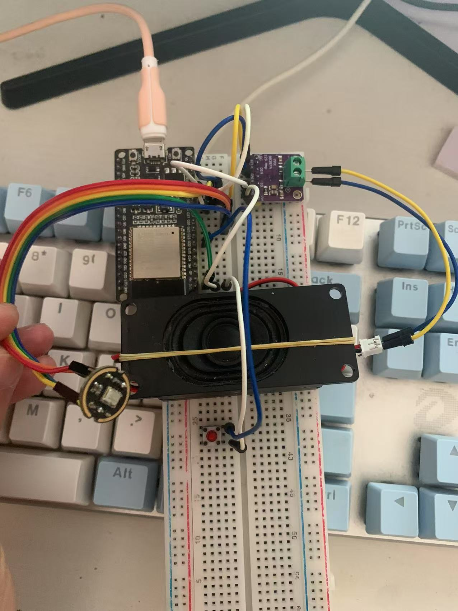
>
> （成本四十元左右）
>
> - 麦克风INMP441（9元）
>
>   - ```
>     # I2S 配置 Pin对应接线GPIO口
>     sck_pin = Pin(26)  # Bit clock
>     ws_pin = Pin(27)   # Word select
>     sd_pin = Pin(25)   # Data line
>     i2s = I2S(1, 
>     sck=sck_pin, 
>     ws=ws_pin, 
>     sd=sd_pin, 
>     mode=I2S.RX,  # 接收模式
>     bits=16,      # 每个样本16位
>     format=I2S.MONO,  # 单声道
>     rate=16000,   # 采样率 16kHz
>     ibuf=4096     # 缓冲区大小
>     )
>     ```
>
> - esp32 wroom 基础版本（20元）
>
> - 喇叭+MAX98357 I2S（11元）
>
>   - ```
>      # I2S配置参数 Pin对应接线GPIO口
>      sck_pin = Pin(26)  # Bit clock
>      ws_pin = Pin(27)   # Word select
>      sd_pin = Pin(25)   # Data line
>       
>     i2s = I2S(1, 
>     sck=sck_pin, 
>     ws=ws_pin, 
>     sd=sd_pin, 
>     mode=I2S.RX,  # 接收模式
>     bits=16,      # 每个样本16位
>     format=I2S.MONO,  # 单声道
>     rate=16000,   # 采样率 16kHz
>     ibuf=4096    # 缓冲区大小
>     )
>     ```
>
>     
>
> - 按钮+杜邦线（1元）
>
> 


### 前置知识

> 需要有一定的 **esp32+micropython** (硬件) + **JavaScript **( nodejs 后台)基础！！！！！

### 架构

> 双 websocket 架构，硬件用 microdot 框架搭建 websocket 服务，后端用 express 搭建 websocket 服务

#### 工作原理（数据交换都是通过 websocket ）

> 硬件讲说话音频发送到后端=》后端进行IAT动态语音识别，得到文字=》大模型识别文字内容做出回复=》将回复内容进行TTS语音合成=》音频数据发送到硬件播放

#### 文件目录

- soft（存放硬件代码）
  - 麦克风发送说话音频数据
  - 喇叭播放音频数据
- backend（存放后台目录代码）
  - 使用 express+websocket

## 如何运行?

1. 组装好硬件
2. 修改配置信息
3. 启动硬件代码
4. 启动后台代码
5. 点击按钮开始对话

效果图

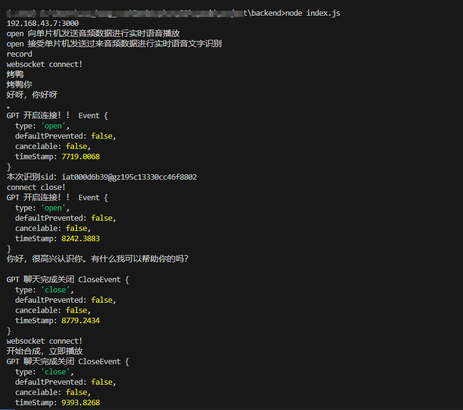


### 硬件方面

- 如下图连接线路，代码中有对应连接Pin口
  
- 
  
- 将 soft 文件中的所有代码上传到esp32中

  - 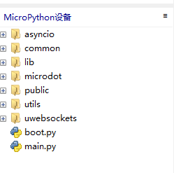

- 将`main.py`代码中基础配置换成自己的

  - ```
    # 服务端请求地址
    url = "http://xxx:3000"
    # wifi名
    ssid = "xxx"
    # wifi密码
    password = "xxx"
    ```

- 运行main.py

  - 出现这种就运行成功了（这里的192.168.43.136是分配个单片机的ip地址，和后端进行通讯会使用这个）
    - 需要自行修改后端服务中的通讯 ip 地址
  - 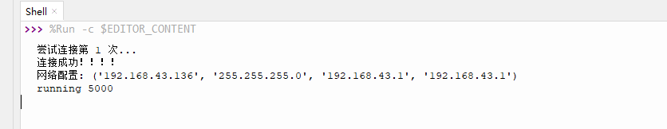


### 后端方面

> （使用 nodejs 搭建后台服务，请确保电脑上有 node环境）

- 去讯飞官方申请应用（全套免费）

  - [控制台-讯飞开放平台](https://console.xfyun.cn/app/myapp)

    - 申请一个应用，应用下的所有功能可以通用`appid,appsecret,appkey`

      - 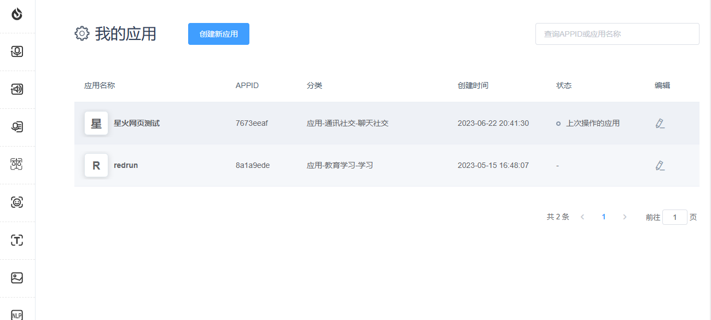

    - 申请星火认知大模型,购买使用量（免费）

      - （`4.0Ultra`版本支持`FunctionCall`）多角色切换就是用 `Function Call`
      - 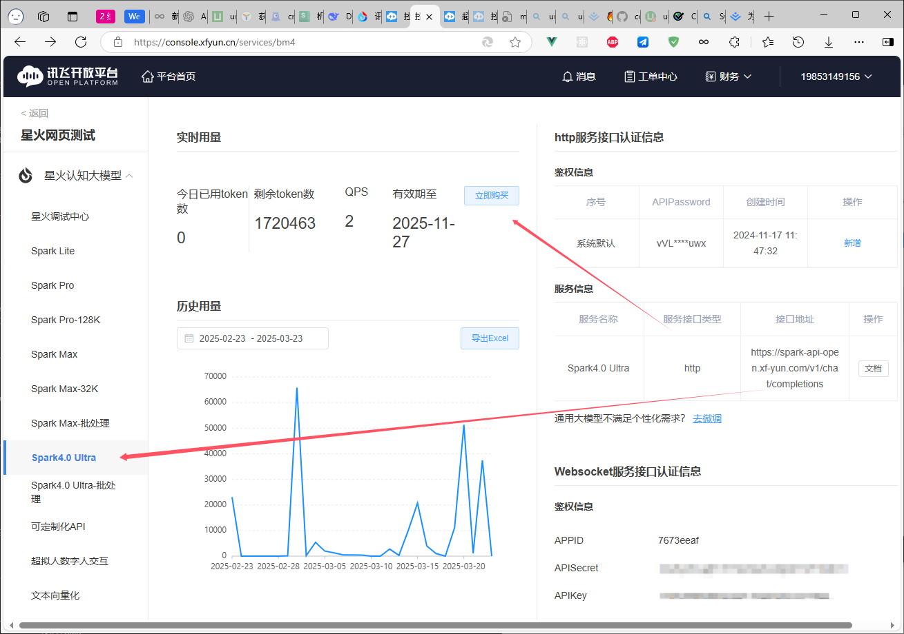

    - 申请超拟人合成,购买使用量（免费）

      - 可以合成带有感情色彩的语音
      - 

    - 申请语音听写,购买使用量（免费）

      - 该功能是事实语音识别，通过该功能可以实现实时对话
      - 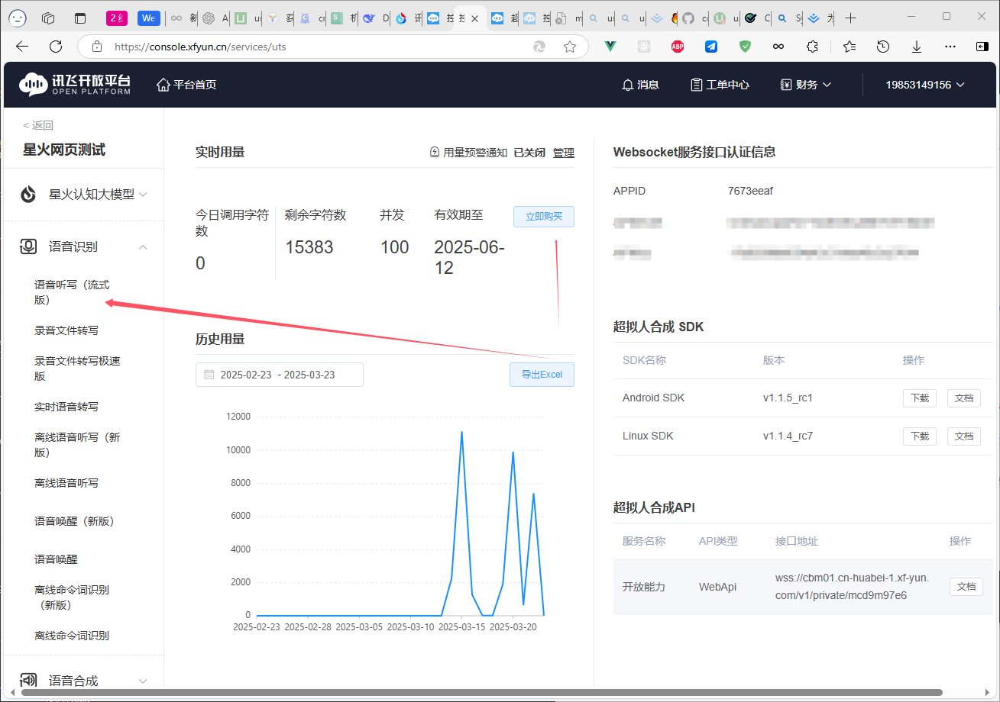

      

- 下载`backend`文件中的代码

  - 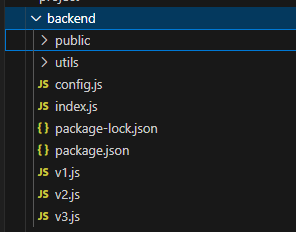

- 修改`config.js`

  - 填写自己的`appid，appsecret，appkey`
  - 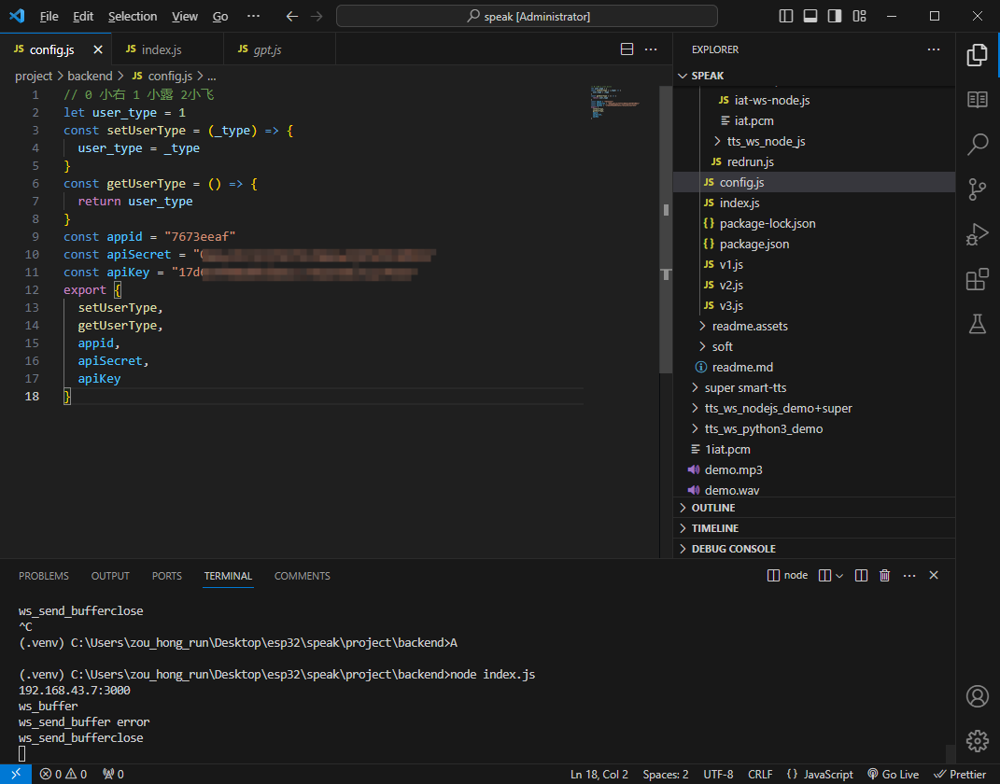

- 进入 backend 目录，执行`npm i`命令安装依赖包

  - 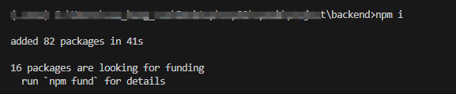

- 运行项目，执行` node index.js`

  - 成功

  - 这里的`192.168.43.7`是分配个单片机的ip地址，和单片机进行通讯会使用这个）

    - 需要自行修改单片机中的通讯 ip 地址

  - 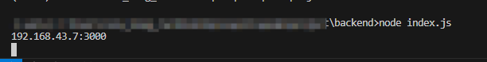

    

## 注意事项

需要确保双方websocket建立连接成功后，才能进行通话

成功连接如下

- 后端
  - 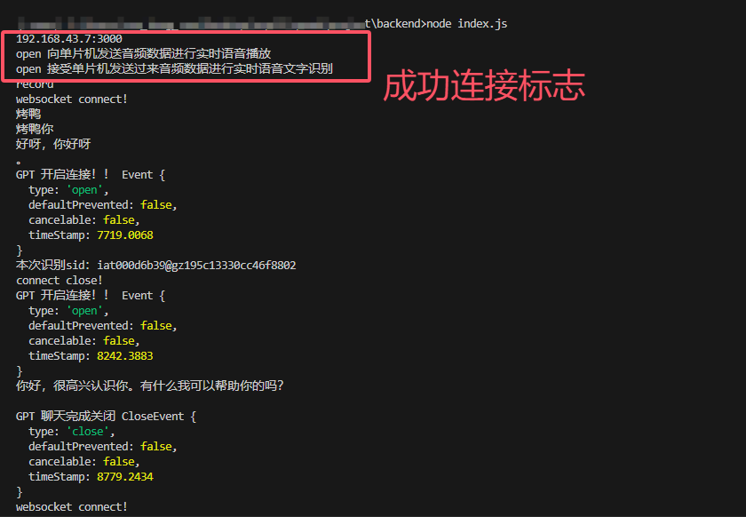
- 单片机
  - 

## 如何找到我？

点击链接加入群聊【js+】：https://qm.qq.com/q/mWtPOKUWvS

## 赞助（您的支持是我最大的更新动力）


